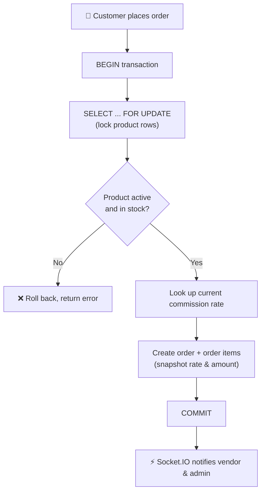

<div align="center">

# 🛒 FurqanStore

**A multi-vendor e-commerce platform, migrated from PHP/MySQL to a modern TypeScript stack — with transaction-safe checkout, a commission engine, role-based access control, and realtime order notifications.**

<br>


</div>

---

## 📑 Table of Contents

- [Overview](#-overview)
- [Features](#-features)
- [User Roles](#-user-roles)
- [Tech Stack](#-tech-stack)
- [Safe Checkout Flow](#-safe-checkout-flow)
- [Bugs Fixed from the PHP Version](#-bugs-fixed-from-the-php-version)
- [Project Structure](#-project-structure)
- [Local Setup](#-local-setup)
- [Deployment (Free Tier)](#-deployment-free-tier)
- [Roadmap](#-roadmap)

---

## 🔭 Overview

FurqanStore is a multi-vendor storefront where customers browse and buy, vendors submit products and earn commission-based revenue, and admins approve vendors, manage orders, and view reports.

It is a full migration of the original PHP/MySQL FurqanStore. The core concepts were preserved (roles, products, categories, cart, orders, vendor earnings, the vendor approval flow, admin reports, and out-of-stock / low-stock badges) and reimplemented in `server/src`, while fixing several security and correctness bugs found in the original code.

---

## ✨ Features

| Feature | Details |
| ------- | ------- |
| 🔐 **Authentication** | JWT access tokens with a rotating `httpOnly` refresh cookie |
| 🛡️ **Role-based access control** | Every admin/vendor route is enforced server-side with `requireAuth` + `requireRole` middleware |
| 🛍️ **Product catalog** | Filters, search, and pagination |
| 🧺 **Cart & checkout** | Transaction-safe checkout with row-level stock locking |
| 💸 **Commission engine** | Configurable rate history with frozen per-order snapshots |
| 🏪 **Vendor workflow** | Product submission and approval flow, vendor approval flow |
| 📊 **Dashboards** | Vendor and admin dashboards with real aggregated figures |
| ⚡ **Realtime updates** | Order status changes and commission notifications pushed to vendors and admins via Socket.IO |
| 🏷️ **Stock badges** | `out_of_stock` and `low_stock` indicators |
| ✉️ **Contact form** | Built in |

---

## 👥 User Roles

| Role | Purpose |
| ---- | ------- |
| `CUSTOMER` | Browse products, use the cart, place orders |
| `VENDOR` | Submit products for approval, manage orders, track earnings |
| `ADMIN` | Approve vendors and products, update order status, view reports |
| `SUPER_ADMIN` | Highest-level administrative access |

---

## 🛠️ Tech Stack

| Layer | Technology |
| ----- | ---------- |
| **Frontend** | React + TypeScript + Vite + Tailwind CSS + TanStack Query + Zustand + React Router |
| **Backend** | Node.js + Express + TypeScript + Prisma ORM |
| **Database** | MySQL (schema in `server/prisma/schema.prisma`) |
| **Realtime** | Socket.IO (room-based vendor/admin order and commission notifications) |
| **Auth** | JWT + bcrypt (cost 12) |

---

## 🔒 Safe Checkout Flow

Checkout runs inside a single Prisma transaction and re-validates against the locked database row, not against whatever the customer last saw on the product page.



Because rows are locked, two simultaneous orders for the last unit of a product can never both succeed. Because each `OrderItem` stores the commission rate and amount used at order time, changing the rate later never rewrites history.

---

## 🐛 Bugs Fixed from the PHP Version

| Original issue | Fix in this version |
| -------------- | ------------------- |
| **Hardcoded 10% commission** in `place-order.php` | Replaced with a `CommissionSetting` table. Every `OrderItem` snapshots the rate and amount used at order time. |
| **`Access-Control-Allow-Origin: *` combined with session cookies** | CORS is locked to `CLIENT_URL` with `credentials: true`. |
| **Mixed password hashing** (raw MD5 for some users, bcrypt for others) | All passwords use bcrypt (cost 12) end to end. Login recognizes only that format. |
| **Race condition on stock** (trigger checked and decremented in separate, non-atomic statements) | Checkout uses `SELECT ... FOR UPDATE` row locks inside a single Prisma transaction. |
| **No re-validation of product status/stock at order time** | Checkout re-checks status and stock against the locked row. |
| **Duplicated DB credentials** hardcoded in `api/orders/place-order.php` | A single `DATABASE_URL` env var is used everywhere via Prisma. |
| **No RBAC enforcement on some admin/vendor actions** | Every admin/vendor route runs through `requireAuth` + `requireRole` on the server. Nothing is authorized by hiding UI. |

---

## 📁 Project Structure

```text
furqanstore-mern/
├── server/                  # Express + Prisma API
│   ├── prisma/schema.prisma # Database schema
│   ├── prisma/seed.ts       # Demo accounts + sample products
│   └── src/
│       ├── routes/          # auth, products, cart, orders, vendor, admin, contact
│       ├── controllers/
│       ├── services/        # commission.service.ts, order.service.ts (the checkout transaction)
│       ├── middleware/      # auth (JWT + RBAC), error handling, validation
│       └── sockets/         # Socket.IO room-based realtime events
└── client/                  # React + Vite storefront + dashboards
    └── src/
        ├── api/             # axios wrappers per resource
        ├── pages/           # Landing, Products, Cart, Checkout, dashboards, auth
        ├── layouts/
        ├── routes/
        └── store/
```

---

## 🚀 Local Setup

### Prerequisites

- Node.js and npm
- A MySQL 8 database, either local or a free hosted one (see [Deployment](#-deployment-free-tier))

### 1. Backend

```bash
cd server
cp .env.example .env      # fill in DATABASE_URL, JWT secrets, CLIENT_URL
npm install
npm run db:push           # creates tables from schema.prisma
npm run prisma:seed       # demo accounts + sample products
npm run dev               # http://localhost:5000
```

### 2. Frontend

```bash
cd client
echo "VITE_API_URL=http://localhost:5000/api" > .env
npm install
npm run dev               # http://localhost:5173
```

### 🔑 Demo Accounts

After seeding, all of these accounts use the password `Password123!`:

| Role | Email |
| ---- | ----- |
| Super Admin | `superadmin@furqanstore.com` |
| Admin | `admin@furqanstore.com` |
| Vendor | `vendor@furqanstore.com` |
| Customer | `customer@furqanstore.com` |

> [!WARNING]
> These demo accounts are for local development and demos only. Do not seed them into a real production database, or change their passwords immediately.

---

## 🌐 Deployment (Free Tier)

| Piece | Recommended free option |
| ----- | ----------------------- |
| **Frontend** | Netlify or Vercel. Connect the `client/` folder, build command `npm run build`, publish directory `dist/` |
| **Backend** | Render free web service. Root `server/`, build command `npm install && npm run build && npx prisma generate`, start command `npm start` |
| **Database** | Railway free MySQL, or Aiven free MySQL plan |

### Steps

1. Push this repository to GitHub.
2. Create the MySQL database on Railway or Aiven and copy its connection string into `DATABASE_URL`.
3. Deploy `server/` to Render as a Web Service. Set all `.env.example` variables in Render's dashboard, run `npx prisma migrate deploy` (or `db push`) once via Render's shell, then `npx tsx prisma/seed.ts` if you want demo data.
4. Deploy `client/` to Netlify and set `VITE_API_URL` to your Render backend's URL + `/api`.
5. Set `CLIENT_URL` on the backend to your Netlify URL (needed for CORS and cookies).

> [!NOTE]
> Render's free tier supports WebSockets, so Socket.IO works without a fallback. If you land on a host that doesn't, TanStack Query's `refetchInterval` on the dashboard queries is a one-line substitute. It is not wired in by default, to keep sockets as the primary path.

---

## 🗺️ Roadmap

### ✅ Included and working end to end

- Auth (JWT access + rotating `httpOnly` refresh cookie) and RBAC
- Product catalog with filters, search, and pagination
- Cart and transaction-safe checkout with row-level stock locking
- Commission engine (rate history + frozen per-order snapshots)
- Vendor product submission and approval flow
- Vendor and admin dashboards with real aggregated figures
- Order status updates with realtime push
- Contact form

### 🚧 Planned

The backend already has the data model and endpoints to support most of these:

- [ ] Full design-system component library
- [ ] Charts on every dashboard panel
- [ ] Order-status-history timeline UI
- [ ] Wishlist
- [ ] Address book UI
- [ ] Notification center UI
- [ ] CSV export on reports
- [ ] Dark / light theme toggle

---

<div align="center">

**🛒 FurqanStore** — Browse • Sell • Earn • Track

⭐ If you like this project, consider giving the repository a star.

</div>
